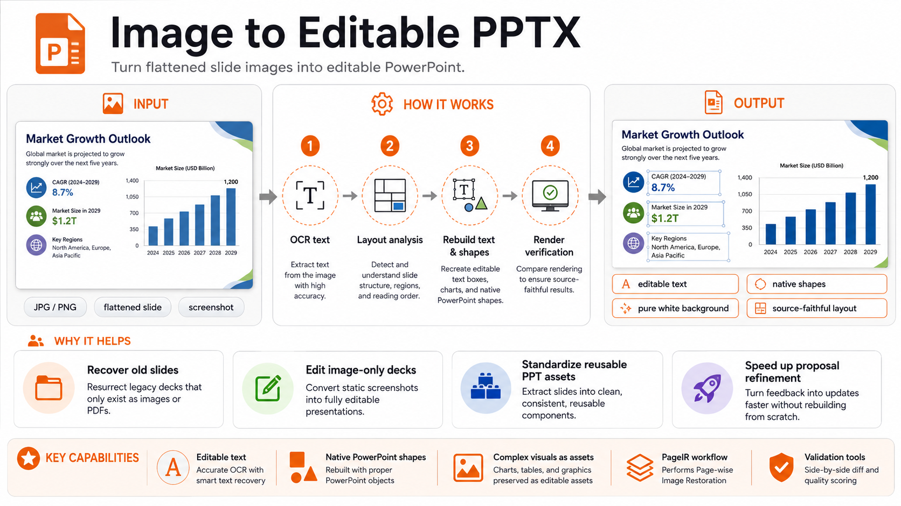

# Image to Editable PPTX

[](https://github.com/algerchen2024/image-to-editable-pptx/actions/workflows/ci.yml)

A publishable ChatGPT Skill and portable reference implementation for rebuilding flattened slide images into source-faithful, editable PowerPoint files.

[中文说明](README.zh-CN.md)

## Product demo

<video controls preload="metadata" playsinline width="960" poster="https://raw.githubusercontent.com/algerchen2024/image-to-editable-pptx/main/docs/showcase/promo-video-poster.png">
  <source src="https://raw.githubusercontent.com/algerchen2024/image-to-editable-pptx/main/docs/showcase/promo-video-preview.mp4" type="video/mp4">
  Your browser does not support inline video playback.
</video>

[Open or download the full-resolution 48.8-second product demo (MP4)](https://github.com/algerchen2024/image-to-editable-pptx/releases/download/v0.1.0/image-to-editable-pptx-promo.mp4)

The video shows the workflow from a flattened slide image to an editable PowerPoint reconstruction. The interface copy is in English, with Chinese narration and bilingual subtitles.

## Showcase examples included in this repository

The two downloadable PPTX files below are **editable PPTX outputs produced with this skill** and are included as README showcase examples.

### English infographic example

**Source infographic**



**Download the editable PPTX generated with this skill**

- [Editable PPTX (English)](docs/showcase/image-to-editable-pptx-demo-en-editable.pptx)
- [Rendered preview of the PPTX output](docs/showcase/english-output-preview.png)

### Chinese infographic example

**Source infographic**


**Download the editable PPTX generated with this skill**

- [Editable PPTX (Chinese)](docs/showcase/image-to-editable-pptx-demo-zh-editable.pptx)
- [Rendered preview of the PPTX output](docs/showcase/chinese-output-preview.png)

## Project at a glance


**What you can do with it**

- Turn flattened slide images, screenshots, and image-only decks into editable PowerPoint files.
- Rebuild readable text as editable text boxes and simple geometry as native PowerPoint shapes.
- Keep complex visuals as explicit assets instead of hiding the whole page behind a screenshot.
- Validate the rendered output against the source so the result stays reviewable.

## Why this README starts with an infographic

The README hero graphic is intentionally designed as an **image-first explanation asset**. It shows the exact type of source material this project is meant to handle: a visually rich, flattened graphic that still needs to become editable presentation content.

In other words, the infographic is not just marketing art — it is a direct demonstration of the project use case.

## What it does

- Recreates readable source text as editable PowerPoint text boxes.
- Rebuilds simple panels, borders, separators, arrows, and geometric elements as native PowerPoint shapes.
- Uses image assets only for complex visuals that are not reliable as native shapes.
- Preserves the source page ratio and source-pixel geometry.
- Supports explicit pure-white-background reconstruction.
- Provides PageIR validation, a generic PptxGenJS compiler, OCR candidate extraction, and render comparison.

## Important scope

A flattened image does not contain the original vectors, chart data, animation, theme metadata, or hidden slide content. This project reconstructs the **visible slide**; it does not claim to recover inaccessible source data.

This public repository is an independently authored clean-room implementation and does not include private/internal skill files. See [NOTICE.md](NOTICE.md), [THIRD_PARTY_NOTICES.md](THIRD_PARTY_NOTICES.md), and [ORIGINALITY_AND_PROVENANCE_REPORT.md](ORIGINALITY_AND_PROVENANCE_REPORT.md).

## Repository layout

```text
SKILL.md                           ChatGPT Skill entrypoint
agents/openai.yaml                 Skill UI metadata
scripts/                           Runtime checks, OCR, PageIR validation, compiler, render comparison
references/                        PageIR schema, workflow, and quality gates
examples/minimal/                  Small PageIR example
docs/readme-infographic.png        README explainer infographic
docs/showcase/                     Bilingual showcase source images and editable PPTX outputs
.github/                           CI and contribution templates
```

## Quick start as a ChatGPT Skill

1. Download the packaged `skill.zip` from a release.
2. Import the skill into a ChatGPT environment that supports Skills.
3. Attach a slide image and ask for a source-faithful editable PPTX.

Example request:

> Convert this flattened slide image into an editable PPTX. Preserve the layout and text, rebuild simple geometry as native shapes, use a pure white background, and verify the rendered result before delivery.

## Local toolchain

Core compilation requires:

- Python 3.11+
- Node.js 20+
- `pptxgenjs` 4.x

Optional but recommended for the full verification loop:

- Tesseract OCR and the required language packs
- LibreOffice
- Poppler (`pdftoppm`)

Install Python dependencies:

```bash
python3 -m pip install -r requirements.txt
```

Install the Node dependency:

```bash
npm install
```

Check the runtime:

```bash
python3 scripts/runtime_check.py --ocr-lang chi_sim+eng
```

Validate and compile the included example:

```bash
python3 scripts/validate_page_ir.py examples/minimal/page_ir.json
node scripts/compile_page_ir.js examples/minimal/page_ir.json example.pptx
```

## PageIR

The compiler consumes a compact JSON representation in source-pixel coordinates. Text, shapes, lines, and image assets are declared explicitly; the compiler only translates those decisions into PowerPoint objects. See [references/pageir-schema.md](references/pageir-schema.md).

## Quality model

The project favors editability and object fidelity over pixel tricks. A high-fidelity result should have exact visible wording, correct slide ratio, aligned major anchors, native simple geometry, and no hidden full-slide screenshot used to fake accuracy.

The render-comparison tool produces `rendered.png`, `diff.png`, and `metrics.json`. Pixel metrics are review signals rather than universal pass/fail thresholds because fonts and presentation renderers vary by platform.

## Development

Run checks:

```bash
python3 scripts/validate_skill.py .
python3 -m unittest discover -s tests -v
python3 scripts/validate_page_ir.py examples/minimal/page_ir.json
node scripts/compile_page_ir.js examples/minimal/page_ir.json /tmp/example.pptx
python3 scripts/inspect_pptx.py /tmp/example.pptx
```

The repository also includes a portable structural Skill validator and packager so the release flow does not depend on private runtime paths.

## Release

Release preparation is documented in [RELEASE_CHECKLIST.md](RELEASE_CHECKLIST.md). The first public GitHub release includes the packaged `skill.zip`, the repository source bundle, SHA256 checksums, and the two bilingual editable-PPTX showcase examples above.

## License

MIT. See [LICENSE](LICENSE).
