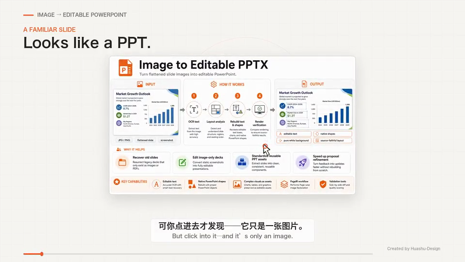

# Image to Editable PPTX

[](https://github.com/algerchen2024/image-to-editable-pptx/actions/workflows/ci.yml)

一个可公开发布的 ChatGPT Skill 与便携式参考实现，用于把扁平化的幻灯片图片重建为**可编辑、可维护、尽量忠实于原图**的 PowerPoint 文件。

[English](README.md)

## 产品宣传视频

[](https://github.com/algerchen2024/image-to-editable-pptx/releases/download/v0.1.0/image-to-editable-pptx-promo.mp4)

[观看或下载 48 秒产品宣传视频（MP4）](https://github.com/algerchen2024/image-to-editable-pptx/releases/download/v0.1.0/image-to-editable-pptx-promo.mp4)

视频演示从扁平化幻灯片图片到可编辑 PowerPoint 的重建流程。界面讲解文字使用英文，配有中文配音和中英双语字幕。

## README 展示样例（仓库内可直接下载）

下面这两份 PPTX 是**使用本 Skill 转出的可编辑 PPTX 成果文件**，并作为 README 的中英文展示样例一并放入仓库。

### 英文信息图样例

**源信息图**


**下载本 Skill 转出的可编辑 PPTX**

- [英文版可编辑 PPTX](docs/showcase/image-to-editable-pptx-demo-en-editable.pptx)
- [PPTX 输出预览图](docs/showcase/english-output-preview.png)

### 中文信息图样例

**源信息图**


**下载本 Skill 转出的可编辑 PPTX**

- [中文版可编辑 PPTX](docs/showcase/image-to-editable-pptx-demo-zh-editable.pptx)
- [PPTX 输出预览图](docs/showcase/chinese-output-preview.png)

## 项目一眼看懂


**它能解决什么问题**

- 把扁平化幻灯片图片、截图、图片版资料恢复成可编辑 PPT。
- 将可识别文字重建为可编辑文本框，将简单几何元素重建为原生 PowerPoint 形状。
- 对复杂视觉元素保留为明确的图片资产，而不是用整页截图“糊”出一个假编辑结果。
- 通过渲染对比与检查工具，让输出结果可验证、可复核。

## 为什么 README 顶部先放信息图

这个 README 主图刻意做成了一个**图像优先的说明型资产**，因为它本身就代表了本项目要处理的典型输入：

- 信息很丰富；
- 视觉结构明确；
- 但源文件已经扁平化，只剩图片；
- 用户仍然希望把它恢复成可编辑的演示文稿内容。

所以这张图不只是宣传图，也是在直观说明本项目的应用场景。

## 主要能力

- 将可读源文字重建为 PowerPoint 可编辑文本框。
- 将面板、边框、分隔线、箭头及简单几何元素重建为原生 PowerPoint 形状。
- 仅在不适合原生重建时，才把复杂视觉内容作为图片资产保留。
- 保留原图页面比例与基于源像素的几何定位。
- 支持明确的纯白背景重建。
- 提供 PageIR 校验、通用 PptxGenJS 编译器、OCR 候选提取与渲染差异检查。

## 重要边界

扁平化图片本身并不包含原始矢量、图表数据、动画、主题元数据或隐藏页面内容。本项目重建的是**用户可见的那一页**，而不是声称恢复不可访问的源数据。

本公开仓库是一个**独立编写的 clean-room 公开实现**，不包含私有/内部 Skill 文件。详见 [NOTICE.md](NOTICE.md)、[THIRD_PARTY_NOTICES.md](THIRD_PARTY_NOTICES.md) 和 [ORIGINALITY_AND_PROVENANCE_REPORT.md](ORIGINALITY_AND_PROVENANCE_REPORT.md)。

## 目录结构

```text
SKILL.md                           ChatGPT Skill 入口说明
agents/openai.yaml                 Skill 元数据
scripts/                           运行检查、OCR、PageIR 校验、编译与渲染对比工具
references/                        PageIR 规范、工作流与质量要求
examples/minimal/                  最小示例 PageIR
docs/readme-infographic.png        README 说明信息图
docs/showcase/                     中英文样例源图与可编辑 PPTX 示例
.github/                           CI 与协作模板
```

## 作为 ChatGPT Skill 的快速使用方式

1. 从 release 下载打包好的 `skill.zip`。
2. 在支持 Skills 的 ChatGPT 环境中导入该 skill。
3. 上传一张幻灯片图片，并要求输出源图忠实的可编辑 PPTX。

示例请求：

> Convert this flattened slide image into an editable PPTX. Preserve the layout and text, rebuild simple geometry as native shapes, use a pure white background, and verify the rendered result before delivery.

## 本地工具链

核心编译能力需要：

- Python 3.11+
- Node.js 20+
- `pptxgenjs` 4.x

完整验证流程推荐额外安装：

- Tesseract OCR 及所需语言包
- LibreOffice
- Poppler (`pdftoppm`)

安装 Python 依赖：

```bash
python3 -m pip install -r requirements.txt
```

安装 Node 依赖：

```bash
npm install
```

运行环境检查：

```bash
python3 scripts/runtime_check.py --ocr-lang chi_sim+eng
```

校验并编译自带示例：

```bash
python3 scripts/validate_page_ir.py examples/minimal/page_ir.json
node scripts/compile_page_ir.js examples/minimal/page_ir.json example.pptx
```

## PageIR

编译器读取一种紧凑的、以源像素为坐标系的 JSON 表示。文本、形状、连线与图片资产都需要显式声明；编译器只负责把这些决策转成 PowerPoint 对象。详见 [references/pageir-schema.md](references/pageir-schema.md)。

## 质量模型

本项目优先保证**可编辑性**与**对象级忠实度**，而不是用像素技巧“伪装”高相似度。高质量结果应具备：可见文字正确、页面比例正确、主要结构锚点对齐、简单几何为原生对象，并且不能靠隐藏整页截图来冒充精确还原。

渲染对比工具会生成 `rendered.png`、`diff.png` 与 `metrics.json`。由于不同平台的字体与渲染器可能不同，像素指标更适合作为复核信号，而不是绝对的跨平台硬阈值。

## 开发与检查

建议执行：

```bash
python3 scripts/validate_skill.py .
python3 -m unittest discover -s tests -v
python3 scripts/validate_page_ir.py examples/minimal/page_ir.json
node scripts/compile_page_ir.js examples/minimal/page_ir.json /tmp/example.pptx
python3 scripts/inspect_pptx.py /tmp/example.pptx
```

仓库内还包含了一个可移植的 Skill 结构校验与打包工具链，因此发布流程不依赖私有运行时路径。

## 发布

发布准备见 [RELEASE_CHECKLIST.md](RELEASE_CHECKLIST.md)。本次首个 GitHub 发布已纳入：`skill.zip`、仓库源码打包、SHA256 校验文件，以及上面这两份中英文可编辑 PPTX 展示样例。

## 许可证

MIT。见 [LICENSE](LICENSE)。
