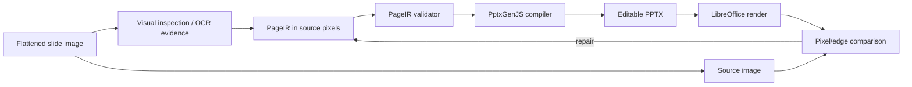

# Architecture

PageIR separates page-specific perception and geometry decisions from the generic PowerPoint compiler. This makes it possible to correct layout, text, and representation decisions without adding special-case slide code.
